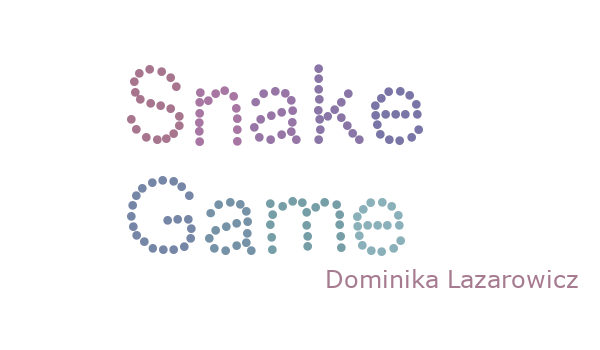

# SnakeGame

## Table of contents
* [General info](#general-info)
* [Technologies](#technologies)
* [Overview](#overview)

## General info
Game is a final project within the framework of studies (subject: basics of computer science)
	
## Technologies
* Language : C#
* Windows Forms

## Overview

Overview in Polish:
https://docs.google.com/document/d/1PKzOQ3y8kERXrbogzHEGg4G0QgrfUkHXiPXYAoij0Mk/edit?usp=sharing

This project is a classic snake game. 
It has 3 difficulty levels (3 speed levels) and tables with the 5 best scores (saved in the .txt file).
